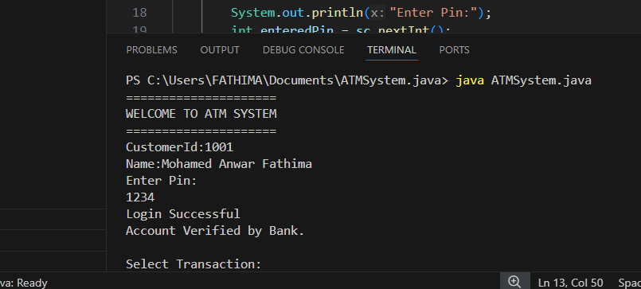
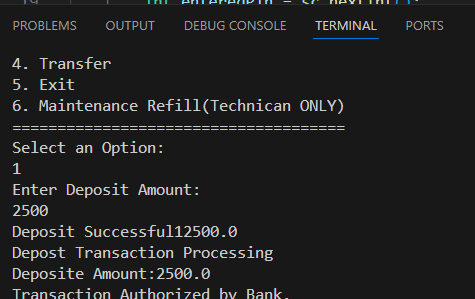
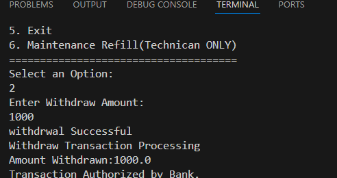
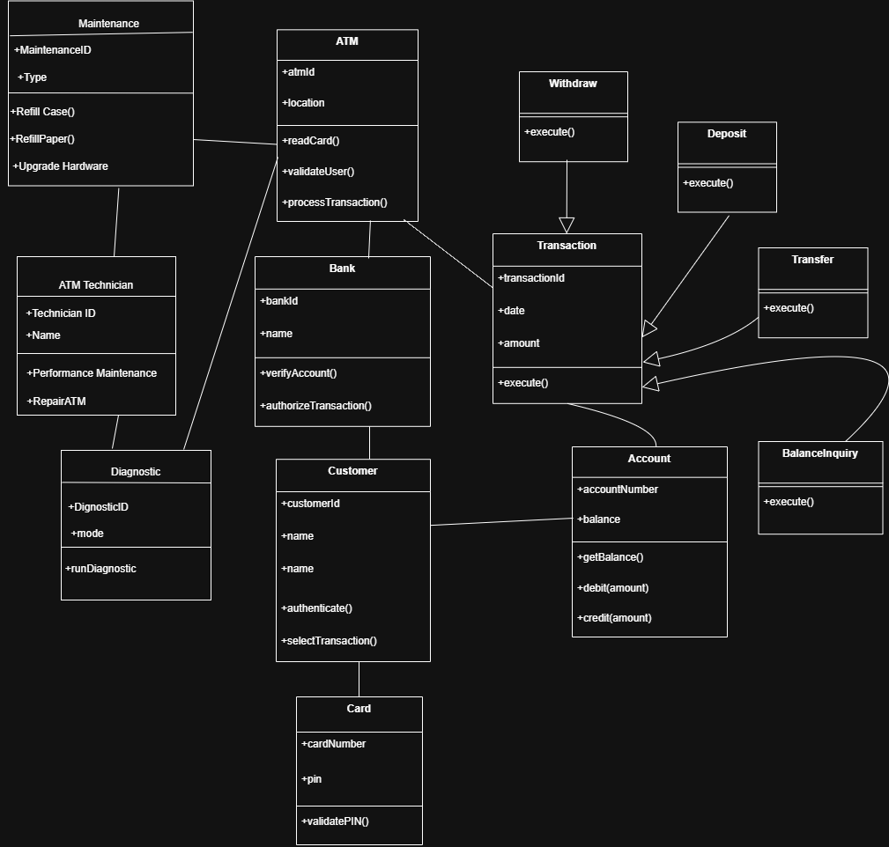

🏧 Java ATM Management System

A simple console-based ATM Management System developed using Java.  
This project demonstrates core Object-Oriented Programming (OOP) concepts and basic system design.

🚀 Features

- 💰 Deposit money
- 💸 Withdraw money
- 📊 Check account balance
- 🔐 Basic account validation (if applicable)
- 🖥️ Console-based user interface

🛠️ Technologies Used

- Java (Core Java)
- Object-Oriented Programming (OOP)
- Command Line Interface (CLI)

📚 Concepts Practiced

- Classes and Objects
- Methods
- Loops and Conditions
- User Input Handling
- Basic System Design

 📸 Screenshots

🔐 Login Screen

💰 Deposit Function

💸 Withdraw Function

🧠 System Design

UML Class Diagram

This diagram represents the structure of the system and relationships between classes.

🎯 Purpose of the Project

This project was built as part of my learning journey in Java programming.  
It helped me understand how real-world banking systems can be structured using programming logic.

🧠 What I Learned

- How to design simple Java applications
- Importance of clean code structure
- Applying OOP concepts in real scenarios
- Problem-solving and logical thinking

🚀 Future Improvements

- Add login system for users
- Implement database integration
- Improve UI using Java GUI or web interface
- Add transaction history feature

Author

Mohamed Anwar Fathima 
Aspiring Java Backend Developer  

GitHub Repository:  
https://github.com/Fathima-TechHub/java-atm-management-system-oop 
